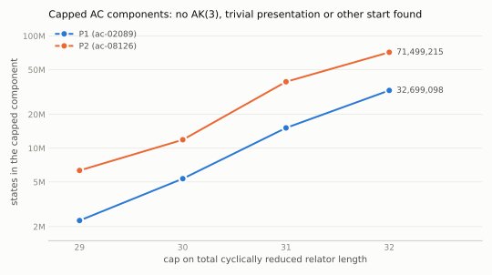
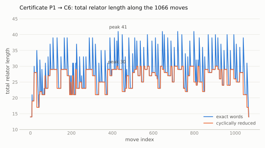
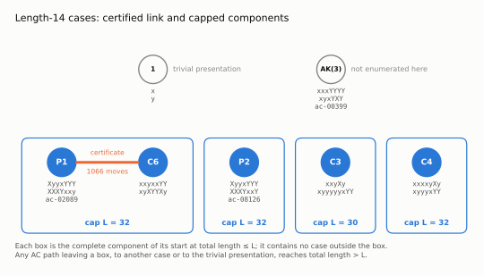

# Andrews–Curtis: two length-14 Miller–Schupp presentations

Status: **computational certificates and search records, not peer reviewed.** First published 2026-09-30.
**Produced by AI models** under the direction of the repository owner; see [`AI_DISCLOSURE.md`](AI_DISCLOSURE.md).

> [!IMPORTANT]
> This repository contains AI-produced, computer-checked results that no human has digested. The AC-equivalence
> certificate (result 1) is a **warrant**: a move sequence replayed by checkers, not a human-readable argument. The capped
> exhaustive searches (results 2, 3) are evidence from an unverified program, not a proof. We do not regard the
> AC-equivalence of these presentations to AK(3) or to the trivial presentation as settled either way by this work.
> We welcome a human-readable treatment, and credit belongs to whoever writes one. Questions, checks and corrections:
> [GitHub issues](https://github.com/alejandrozarco/andrews-curtis-ms14/issues).

Presentations (relators as words; capital letters are inverses, `X` = $`x^{-1}`$):

| name | relators | SAIR ACC id |
|---|---|---|
| P1 = MS(2, $`x^{-2}y^{-1}x^{2}y`$) | `XyyxYYY`, `XXXYxxy` | ac-02089 |
| P2 = MS(2, $`x^{-2}y^{-1}x^{2}y^{-1}`$) | `XyyxYYY`, `XXXYxxY` | ac-08126 |
| C6 | `xxyxxYY`, `xyXYYXy` (i.e. $`x^2yx^2y^{-2}`$, $`xyx^{-1}y^{-2}x^{-1}y`$) | — |
| C3 | `xxyXy`, `xyyyyyxYY` (i.e. $`x^2yx^{-1}y`$, $`xy^5xy^{-2}`$) | — |
| C4 | `xxxxyXy`, `xyyyxYY` (i.e. $`x^4yx^{-1}y`$, $`xy^3xy^{-2}`$) | — |
| AK(3) | `xxxYYYY`, `xyxYXY` | ac-00399 |

## Results

1. **P1 and C6 are AC-equivalent.** `certs/P1_equiv_C6.json` lists 1066 elementary AC moves from P1 to a presentation
   in the swap/inversion/cyclic-rotation orbit of C6 (peak total relator length 41 as exact words).
   `python3 verify.py certs/P1_equiv_C6.json` replays it.
2. **Exhaustive search.** For each start P1, P2, the set of presentations reachable by AC moves without the total
   relator length (cyclically reduced) exceeding a cap $`L`$ was enumerated completely, for $`L = 29,\dots,32`$
   (search model and its completeness condition below).
   None of these sets contains AK(3), the other start, or the trivial presentation (the P1 sets contain C6).
   So, under this search model, any AC path from P1 or P2 to AK(3), to each other, or to the trivial presentation
   reaches total length $`\ge 33`$.

| start | cap 29 | cap 30 | cap 31 | cap 32 |
|---|---|---|---|---|
| P1 | 2,267,706 | 5,349,664 | 15,165,074 | 32,699,098 |
| P2 | 6,331,998 | 11,889,832 | 39,047,968 | 71,499,215 |

(states, counted up to relator swap, inversion, cyclic rotation and the 8 signed letter permutations; `runs/*.log`;
conjugator bound $`K = 8`$ for caps 29–31 and $`K = 9`$ for cap 32, `runs/exh_P1_c32_k9.log`, `runs/exh_P2_c32_k9.log`).

Correction (2026-09-30): the first version used $`K = 8`$ at cap 32, which the completeness condition below does not
cover. The cap-32 runs were repeated with $`K = 9`$ and give the same components (same state counts, level by level);
the $`K = 8`$ logs are kept as `runs/exh_P1_c32.log`, `runs/exh_P2_c32.log`.

3. **Same enumeration from C3 and C4** (with C6, residual length-14 classes of github.com/nahomar/andrews-curtis-solver).
   None of these sets contains AK(3), P1, P2, C6, the other start, or the trivial presentation.

| start | cap 29 | cap 30 | cap 31 | cap 32 |
|---|---|---|---|---|
| C3 | 25,978,085 | 58,196,612 | — | — |
| C4 | 269,500 | 627,909 | 1,544,676 | 3,657,734 |

($`K = 8`$, and $`K = 9`$ at cap 32; `runs/exh_C3_*.log`, `runs/exh_C4_*.log`.)

## Figures

Regenerate with `python3 figures/make_figures.py` (matplotlib), from `runs/*.log` and `certs/P1_equiv_C6.json`
(only complete runs whose conjugator bound meets the completeness condition are used).

<picture>
  <source media="(prefers-color-scheme: dark)" srcset="figures/search_growth_dark.svg">
  
</picture>

Size of the capped components (result 2), log scale.

<picture>
  <source media="(prefers-color-scheme: dark)" srcset="figures/certificate_profile_dark.svg">
  
</picture>

Total relator length along the certificate of result 1, as exact words and cyclically reduced.

<picture>
  <source media="(prefers-color-scheme: dark)" srcset="figures/hard_cases_dark.svg">
  
</picture>

Certified link (result 1) and completely enumerated capped components (results 2, 3). An AC path from a case to any
case outside its box, or to the trivial presentation, reaches a total length above the cap of the box.

## Search model (for result 2)

`acsearch.cpp`: states are unordered pairs of cyclically reduced words modulo rotation, inversion, swap and the
signed letter permutations $`\varphi`$; moves $`u \leftarrow \mathrm{CR}(\mathrm{rot}_i(u)\, c\, \mathrm{rot}_j(v^{\pm1})\, c^{-1})`$
for all rotations and junction-free conjugators $`c`$ of length $`\le K`$. This graph contains the projection of the
elementary AC graph at cap $`L`$ provided $`K \ge \lfloor (L - m)/2 \rfloor`$, where $`m`$ is the minimum total length of a state in the
component (an exact state $`(a u a^{-1}, b v b^{-1})`$ projects to $`\{u, v\}`$, and a multiplication projects to the
move with $`c = a^{-1}b`$, $`|c| \le |a| + |b| \le (L - |u| - |v|)/2`$). Here $`m = 14`$, so $`K = 8`$ suffices for
$`L \le 31`$ and $`K = 9`$ is used for $`L = 32`$. The $`\varphi`$-quotient is justified by explicit AC paths from AK(3) to each
$`\varphi(\mathrm{AK}(3))`$ (`certs/phi/`, checked by `verify.py`). Validation: the rotation-only variant reproduces the
component sizes 680,700 (P1) and 1,880,041 (P2) at cap 28 reported in github.com/nahomar/andrews-curtis-solver;
`validate_projection.py` checks the projection claim on random elementary walks with a negative control.
The completeness of the enumeration rests on this code; it is not formally verified.

## Independent replay with the SAIR ACC reference implementation

`sair_check/` converts every certificate in `certs/` (P1 ~ C6, the five certificates of Carreras, arXiv:2607.23611,
in `certs/carreras/`) to the move format of github.com/SAIRcompetition/Andrews-Curtis (commit `a0fd6e6`) and replays
it with that repository's `verifier.core.apply_move` from its official initial relators; all end states agree with
`verify.py` (`sair_check/generated/report.json`). The official verifier only accepts trivialisations, so it reports
`E_NOT_TARGET` for these equivalence certificates, as expected.

## Reproduce

```sh
python3 verify.py --selftest
python3 verify.py certs/P1_equiv_C6.json certs/carreras/*.json certs/phi/*.json
c++ -O2 -std=c++17 -o acsearch acsearch.cpp     # see the header of acsearch.cpp for options
git clone https://github.com/SAIRcompetition/Andrews-Curtis sair-ac
SAIR_REPO=sair-ac python3 sair_check/check_all.py
```

Python 3.9+, no third-party packages for `verify.py`. The cap-32 enumerations need ~2 GB and 20–30 min per start
(`acsearch_lean.cpp` is the lower-memory variant).

## References

- D. Carreras, arXiv:2607.23611 (2026).
- A. Shehper et al., *What makes math problems hard for reinforcement learning: a case study*, arXiv:2408.15332 (2024).
- github.com/nahomar/andrews-curtis-solver (2026).
- SAIR ACC Challenge, github.com/SAIRcompetition/Andrews-Curtis.

`MANIFEST.sha256` lists every file.
